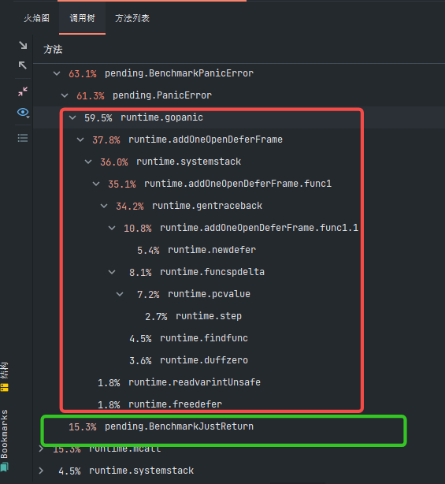

**addOneOpenDeferFrame**:       
扫描堆栈的第一个帧(如果有)与开放编码的defer，如果它找到一个，添加一个记录到该帧的延迟链。如果sp为非空值，则从sp指定的帧开始栈扫描       
注意:如果堆栈在运行defer函数时移动，defer链的所有条目(包括这个新的开放编码条目)都有它们的指针(包括sp)适当调整。此外，传递sp参数(它是调用getcallersp()的直接结果)也是安全的，因为所有指针变量(包括参数)都在堆栈复制期间根据需要进行调整。        

**systemstack**     
在系统栈上运行入参函数。如果系统堆栈从每个os线程(g0)堆栈调用，或者如果系统堆栈从信号处理(gsignal)堆栈调用，系统堆栈直接调用入参函数并返回。否则，系统堆栈将从普通goroutine的有限堆栈中被调用。在这种情况下，系统堆栈切换到每个os线程堆栈，调用入参函数，然后切换回来。为了与调用系统堆栈的代码共享输入和输出，通常使用func作为入参      

一般 recovery 函数与panic搭配使用       

recovery 流程如下       
```go
func recovery(gp *g) {
// 取出栈寄存器和程序计数器的值
    sp := gp.sigcode0
    pc := gp.sigcode1
// 重置 goroutine 的 pc，sp 寄存器；
    gp.sched.sp = sp
    gp.sched.pc = pc
// 重新投入调度队列
    gogo(&gp.sched)
}
```